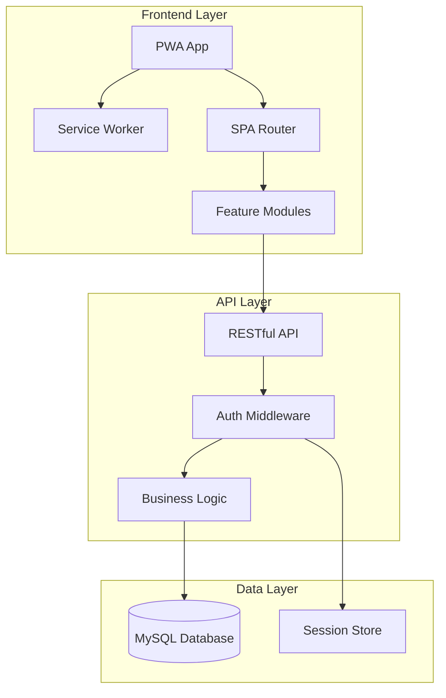
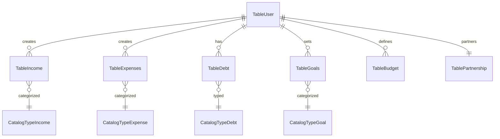

# 💰 Yoda Finances - Smart Couple's Financial Management System

<div align="center">
  
  <br><br>
</div>

  [](https://php.net)
  [](https://www.mysql.com)
  [](https://web.dev/progressive-web-apps/)
  [](LICENSE)

  **A modern, feature-rich financial management application designed for couples**

  [Live Demo](https://yoda.nexuslogicit.com) | [Features](#features) | [Installation](#installation) | [Documentation](#documentation)


---

## 🌟 Overview

Yoda Finances is a comprehensive web-based financial management system specifically designed for couples who want to track their individual and shared finances efficiently. Built with modern web technologies and a focus on user experience, it provides powerful tools for budget management, expense tracking, debt monitoring, and financial goal planning.

### 🎯 Key Differentiators

- **Couple-Centric Design**: Built from the ground up for managing both individual and shared finances
- **Smart Expense Splitting**: Automatic calculation of who owes whom in the relationship
- **Biweekly (Quincenal) System**: Aligned with Mexican payment schedules
- **Real-time Insights**: Interactive dashboards with projection charts
- **Offline-First PWA**: Works without internet connection
- **No External Dependencies**: Pure vanilla JavaScript for maximum performance

## 🚀 Live Demo

Experience the application with our demo account:

```
URL: https://yoda.nexuslogicit.com
Email: demo@yodafinances.com
Password: Demo2024!
```

*Note: Demo data resets every 24 hours*

## ✨ Features

### 📊 Financial Dashboard
- Real-time balance overview
- Monthly income vs. expenses chart
- Biweekly (quincenal) projection similar to Excel
- Visual spending patterns and trends
- Quick stats widgets

### 💵 Income Management
- Track multiple income sources
- Categorize by type (Salary, Bonus, Freelance, etc.)
- Expected vs. actual income comparison
- Individual and joint income tracking

### 🛒 Expense Tracking
- Detailed categorization system
- Payment status tracking (Paid, Partial, Pending)
- Shared expense management for couples
- Budget vs. actual spending analysis
- Receipt notes and annotations

### 💳 Debt Management
- Credit card tracking
- Loan amortization visualization
- Progress bars for debt payoff
- Multiple debt instrument support
- Interest calculation helpers

### 🎯 Savings Goals
- Visual goal progress tracking
- Short, medium, and long-term planning
- Individual and shared goals
- Automatic savings calculation
- Achievement milestones

### 👫 Couple Features
- **Partnership System**: Link accounts as a couple
- **Expense Splitting**: Automatic 50/50 or custom splits
- **Balance Calculator**: See who owes whom
- **Shared Budgets**: Joint financial planning
- **Individual Privacy**: Maintain personal financial space

### 📱 Progressive Web App (PWA)
- Install as mobile/desktop app
- Offline functionality
- Push notifications for budget alerts
- Automatic data sync when online
- Native app-like experience

### 🔐 Security & Privacy
- Secure password hashing (bcrypt)
- Session-based authentication
- 8-hour auto-logout for security
- Role-based access control
- Encrypted sensitive data

## 🏗️ Architecture

### Tech Stack

<table>
<tr>
<td align="center" width="96">
  
  <br>PHP 8+
</td>
<td align="center" width="96">
  
  <br>MySQL
</td>
<td align="center" width="96">
  
  <br>JavaScript
</td>
<td align="center" width="96">
  
  <br>CSS3
</td>
<td align="center" width="96">
  
  <br>Chart.js
</td>
</tr>
</table>

### System Architecture



### Database Schema

The application uses a normalized relational database with 17 tables:



## 📁 Project Structure

```
yoda-finances/
├── 📂 api/                 # RESTful API endpoints
│   ├── auth.php           # Authentication
│   ├── dashboard.php      # Dashboard data
│   ├── income.php         # Income CRUD
│   ├── expenses.php       # Expenses CRUD
│   ├── debt.php           # Debt management
│   ├── goals.php          # Savings goals
│   ├── partnership.php    # Couple features
│   └── budgets.php        # Budget management
├── 📂 core/                # Core PHP classes
│   ├── Database.php       # PDO wrapper
│   ├── Auth.php           # Authentication
│   └── Response.php       # API responses
├── 📂 js/app/             # JavaScript modules
│   ├── core.js            # Router & utilities
│   ├── dashboard.js       # Dashboard module
│   ├── income.js          # Income module
│   ├── expenses.js        # Expenses module
│   └── [other modules]
├── 📂 css/                # Stylesheets
│   ├── style.css          # Design tokens
│   └── app.css            # Application styles
├── 📂 sql/                # Database scripts
│   ├── schema.sql         # Table definitions
│   ├── init_catalogs.sql  # Initial data
│   └── demo_user.sql      # Demo data
├── index.php              # Login page
├── app.php                # Main application
├── manifest.json          # PWA manifest
└── sw.js                  # Service Worker
```

## 🚀 Installation

### Prerequisites

- PHP 8.0 or higher
- MySQL 5.7 or higher / MariaDB 10.3+
- Apache/Nginx web server
- Composer (optional, for future dependencies)

### Step 1: Clone the Repository

```bash
git clone https://github.com/danielalmazan-manager/yodafinancesapp.git
cd yodafinancesapp
```

### Step 2: Configure Database

1. Create a MySQL database:
```sql
CREATE DATABASE yoda_finances CHARACTER SET utf8mb4 COLLATE utf8mb4_unicode_ci;
```

2. Import the schema and initial data:
```bash
mysql -u your_user -p yoda_finances < sql/schema.sql
mysql -u your_user -p yoda_finances < sql/init_catalogs.sql
mysql -u your_user -p yoda_finances < sql/demo_user.sql  # Optional: demo data
```

3. Copy and configure database settings:
```bash
cp config/database.example.php config/database.php
# Edit config/database.php with your credentials
```

### Step 3: Configure Web Server

#### Apache (.htaccess)
```apache
RewriteEngine On
RewriteCond %{REQUEST_FILENAME} !-f
RewriteCond %{REQUEST_FILENAME} !-d
RewriteRule ^api/(.*)$ api/$1.php [L,QSA]
```

#### Nginx
```nginx
location / {
    try_files $uri $uri/ /index.php?$query_string;
}

location ~ ^/api/(.*)$ {
    try_files /api/$1.php =404;
    include fastcgi_params;
    fastcgi_pass unix:/var/run/php/php8.0-fpm.sock;
}
```

### Step 4: Set Permissions

```bash
chmod 755 -R .
chmod 777 -R logs/  # If you have a logs directory
```

### Step 5: Access the Application

Navigate to `http://your-domain.com` and login with the demo credentials or create your own account.

## 📱 PWA Installation

### Mobile (Android/iOS)
1. Open the app in Chrome/Safari
2. Tap the menu (⋮) or share button
3. Select "Add to Home Screen"
4. Follow the prompts

### Desktop (Chrome/Edge)
1. Look for the install icon in the address bar
2. Click "Install"
3. The app will open in its own window

## 🧪 Testing

### Manual Testing Checklist

- [ ] User authentication (login/logout)
- [ ] Income CRUD operations
- [ ] Expense tracking with categories
- [ ] Debt management features
- [ ] Goal creation and progress
- [ ] Partnership linking
- [ ] Budget alerts
- [ ] Offline functionality
- [ ] PWA installation
- [ ] Responsive design (mobile/tablet/desktop)

## 🤝 API Documentation

### Authentication

```http
POST /api/auth.php
Content-Type: application/json

{
    "email": "user@example.com",
    "password": "userpassword"
}
```

### Dashboard Data

```http
GET /api/dashboard.php
Authorization: Session Cookie
```

Response:
```json
{
    "success": true,
    "data": {
        "summary": {
            "totalBalance": 45000,
            "totalIncome": 70000,
            "pendingExpenses": 25000
        },
        "chart": [...],
        "recent": [...]
    }
}
```

### Income Management

```http
POST /api/income.php
Content-Type: application/json

{
    "amountToBeReceived": 35000,
    "actualAmountReceived": 35000,
    "idTypeIncome": 1,
    "idCatDate": 5,
    "txtNotes": "Monthly salary"
}
```

*Full API documentation available in [docs/API.md](docs/API.md)*

## 🔧 Configuration

### Environment Variables

Create a `.env` file (optional for future enhancements):

```env
APP_NAME=Yoda Finances
APP_ENV=production
APP_DEBUG=false
APP_URL=https://your-domain.com

DB_HOST=localhost
DB_PORT=3306
DB_DATABASE=yoda_finances
DB_USERNAME=your_username
DB_PASSWORD=your_password

SESSION_LIFETIME=480
```

## 📈 Performance Optimization

- **Lazy Loading**: Modules loaded on demand
- **Service Worker**: Intelligent caching strategy
- **Minification**: CSS/JS minified in production
- **Database Indexing**: Optimized queries
- **CDN Ready**: Static assets can be served from CDN

## 🛡️ Security Features

- Password hashing with bcrypt
- Prepared statements prevent SQL injection
- XSS protection through output escaping
- CSRF tokens for form submissions
- Secure session management
- HTTPS enforcement in production

## 🎯 Future Enhancements

- [ ] Multi-currency support
- [ ] Data export (Excel/PDF)
- [ ] Email notifications
- [ ] Recurring transactions
- [ ] Bill reminders
- [ ] Financial reports
- [ ] Dark/Light theme toggle
- [ ] Mobile app (React Native)
- [ ] AI-powered insights
- [ ] Bank account integration

## 👥 Contributing

We welcome contributions! Please see [CONTRIBUTING.md](CONTRIBUTING.md) for details.

1. Fork the repository
2. Create your feature branch (`git checkout -b feature/AmazingFeature`)
3. Commit your changes (`git commit -m 'Add some AmazingFeature'`)
4. Push to the branch (`git push origin feature/AmazingFeature`)
5. Open a Pull Request

## 📝 License

This project is licensed under the MIT License - see the [LICENSE](LICENSE) file for details.

## 🙏 Acknowledgments

- Chart.js for beautiful charts
- PHP community for excellent documentation
- Mexican financial system for quincenal inspiration
- All contributors and testers

## 📞 Contact

**Daniel Almazán**
IT Project Manager · Technical Architect · Systems Integration Specialist

[](https://www.linkedin.com/in/daniel-almazan-l/)
[](mailto:daniel.almazan.lopez16@gmail.com)
[](https://github.com/danielalmazan-manager?tab=repositories)

---

<div align="center">
  <strong>Built with ❤️ for couples who want to manage their finances together</strong>

  ⭐ Star this repository if you find it helpful!
</div>